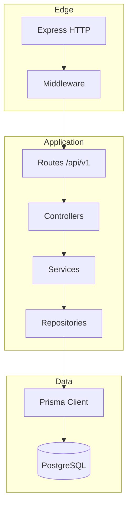
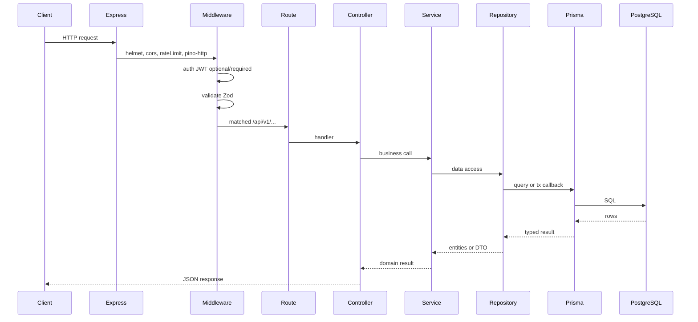

# Архітектура

**Пов’язано:** [01-overview.md](01-overview.md) · [03-project-structure.md](03-project-structure.md) · [04-tech-stack.md](04-tech-stack.md)

## Підхід

**Багатошаровий бекенд** на Express: тонкі контролери, бізнес-логіка в **сервісах**, доступ до даних через **репозиторії** (тонкий шар над **Prisma**), валідація вхідних/вихідних даних через **Zod**, публічний контракт API — **OpenAPI**, згенерований з тих самих Zod-схем (`@asteasolutions/zod-to-openapi`).

## Шари та відповідальність

| Шар                  | Роль                                                                                                                      |
| -------------------- | ------------------------------------------------------------------------------------------------------------------------- |
| **Routes**           | Монтування роутерів, префікс `/api/v1`, підключення middleware                                                            |
| **Middleware**       | Auth, валідація (Zod), rate limit, логування, обробка помилок                                                             |
| **Controllers**      | Парсинг `req` / виклик сервісу / формування HTTP-відповіді (без бізнес-правил)                                            |
| **Services**         | Правила предметної області, orchestration, межа **`prisma.$transaction`** для узгоджених змін                             |
| **Repositories**     | Запити та зміни даних через Prisma (без бізнес-правил); складні `where` / joins зібрані тут                               |
| **Prisma**           | ORM, міграції, типобезпечні запити (використовується лише з репозиторіїв або в межах транзакції, переданої в репозиторій) |
| **Validators (Zod)** | Схеми body/query/params/response, реєстр для OpenAPI                                                                      |

## Потік HTTP-запиту (послідовність)

## Межі шарів (правила)

1. **Controllers** не викликають ні Prisma, ні репозиторії напряму — лише **сервіси** (виняток: дуже тонкий health-check до БД, якщо узгоджено окремо).
2. **Services** не читають `req`/`res`; не імпортують `PrismaClient` напряму — лише **репозиторії** (або абстракцію над ними). Транзакції: сервіс викликає `prisma.$transaction`, усередині — методи репозиторію з **`Prisma.TransactionClient`** (або еквівалентний патерн DI).
3. **Repositories** містять лише доступ до даних (CRUD, фільтри, пагінація); **без** бізнес-правил і без знання про HTTP.
4. **Zod** — єдина точка валідації вхідних даних на межі HTTP; внутрішні DTO можна типізувати через Prisma/Zod infer.
5. **Помилки** — тільки через ієрархію `AppError` + глобальний error middleware (див. [10-error-handling.md](10-error-handling.md)).

## Додаткова інфраструктура (локально)

Окрім PostgreSQL, у Docker Compose можуть працювати **Redis** та **S3-сумісне сховище (MinIO)** для parity з продакшеном. На діаграмі шарів вони не показані: підключення відбувається з **сервісів** або окремих адаптерів, коли з’являється відповідний код. Порти, змінні оточення та режими запуску: [14-setup.md](14-setup.md).

## Версіонування API

Усі публічні маршрути — під префіксом **`/api/v1`**. Зміна breaking behavior — нова версія `v2` (паралельно або з deprecation-періодом у документації).

## Модульність у межах одного репозиторію

Рекомендовано групувати за доменом у `services/`, **`repositories/`** та `routes/` (наприклад, `auth`, `accounts`, `transactions`), щоб троє розробників мінімально перетиналися в одних файлах.

## Навігація

- Структура папок: [03-project-structure.md](03-project-structure.md)
- Технології: [04-tech-stack.md](04-tech-stack.md)
- ADR: [adr/0003-repository-layer.md](adr/0003-repository-layer.md)
