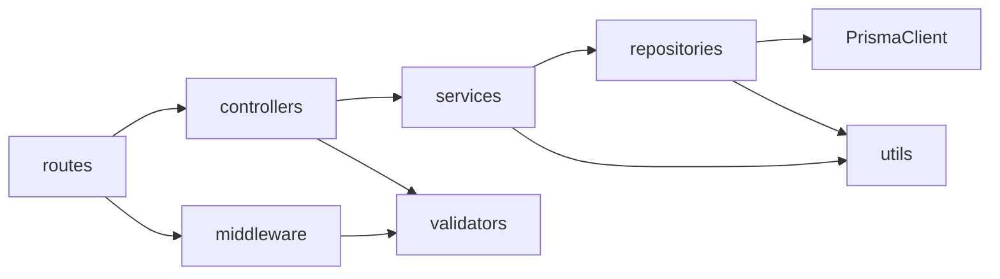

# Структура проєкту

**Пов’язано:** [02-architecture.md](02-architecture.md) · [15-conventions.md](15-conventions.md)

## Дерево (цільове)

```text
finance-tracker/
├── src/
│   ├── config/          # env validation, DB, app config
│   ├── controllers/     # request handlers (thin)
│   ├── services/        # business logic, orchestration, transaction boundaries
│   ├── repositories/    # data access via Prisma (no business rules)
│   ├── middleware/      # auth, validation, error, logging, rate-limit
│   ├── routes/          # Express routers, versioned (/api/v1)
│   ├── validators/      # Zod schemas (input/output)
│   ├── utils/           # error classes, constants, helpers
│   ├── types/           # shared TS types
│   └── index.ts         # app bootstrap
├── prisma/              # schema.prisma, migrations, seed
├── tests/               # unit, integration, e2e
├── docker/              # compose, Dockerfile
├── .github/workflows/   # CI/CD
├── docs/                # architecture, API, runbooks
├── package.json
└── tsconfig.json
```

## `src/config/`

- **Призначення:** завантаження та **валідація змінних середовища** (наприклад, через Zod-об’єкт `env`), експорт `config` для додатку.
- **Типові файли:** `env.ts`, `database.ts` (URL, pool), `app.ts` (port, node env).
- **Правило:** жодного `process.env` поза `config/` (крім тестових моків).

## `src/controllers/`

- **Призначення:** тонкі **HTTP-адаптери**: витягти валідовані дані, викликати **один** метод сервісу, повернути статус і тіло.
- **Заборонено:** складні `if` бізнес-логіки, прямі виклики **Prisma** або **репозиторіїв** (лише сервіси).

## `src/services/`

- **Призначення:** **бізнес-логіка**, інваріанти (недостатньо коштів, закритий рахунок), orchestration викликів **репозиторіїв**.
- **Транзакції:** межа **`prisma.$transaction`** залишається в сервісі; репозиторії отримують клієнт транзакції (`tx`) для узгоджених читань/записів.
- **Рекомендація:** один файл/модуль на агрегат (наприклад, `transactionService.ts`).

## `src/repositories/`

- **Призначення:** **рівень доступу до даних** — усі виклики `prisma.*` для домену зібрані тут (запити, `create`/`update`/`delete`, складні `where`, курсори пагінації).
- **Не містить:** правил «чи можна списати», перевірок бюджету, знань про JWT — це зона **services**.
- **Розміщення:** каталог **`src/repositories/`** на одному рівні з `services/` — **не** всередині **`prisma/`** на корені репо (там лише `schema.prisma`, міграції, seed).
- **Рекомендація:** `userRepository.ts`, `transactionRepository.ts` тощо; за потреби спільний модуль `prismaClient.ts` у `config/` або `repositories/db.ts`, що експортує singleton `prisma`.

## `src/middleware/`

- **Призначення:** різні cross-cutting concern’и.
- **Типові модулі:** `auth.ts` (перевірка JWT), `validate.ts` (підключення Zod до маршруту), `errorHandler.ts`, `requestId.ts` / correlation id, `rateLimit.ts`, `notFound.ts`.

## `src/routes/`

- **Призначення:** **Express Router**-и, без логіки. Підключають middleware chain і controller.
- **Версіонування:** кореневий роутер монтує дочірні під `/api/v1` (наприклад, `routes/v1/index.ts`).

## `src/validators/`

- **Призначення:** **Zod**-схеми для input (body, query, params) і **output** (response), плюс реєстрація для **OpenAPI** (`@asteasolutions/zod-to-openapi`).
- **Правило:** схема в одному місці — джерело істини для валідації та документації.

## `src/utils/`

- **Призначення:** чисті функції, константи, **класи помилок** (`AppError`), хелпери (форматування дат, пагінація), без залежності від Express.

## `src/types/`

- **Призначення:** спільні TypeScript-типи, які не згенеровані Prisma (наприклад, публічні DTO для клієнта), utility types.

## `src/index.ts`

- **Призначення:** створення `app`, підключення `helmet`, `cors`, `pino-http`, маршрутів, error handler, `listen` або експорт для суперестів.

## `prisma/`

- `schema.prisma` — модель даних, `migrations/` — історія змін, `seed.ts` — демо-дані для dev/staging.

## `tests/`

- `unit/` — сервіси з моками **репозиторіїв** (або Prisma, якщо сервіс ще не відрефакторений); `integration/` — Supertest + app + тестова БД або мок репозиторію/Prisma; `e2e/` (опційно) — повний сценарій.

## `docker/`

- `docker/Dockerfile` багатоетапний (build + production), кореневий `docker-compose.yml` — app + postgres (і опційно pgadmin).

## `.github/workflows/`

- YAML для CI: lint, test, build, security scan, docker publish (див. [13-ci-cd.md](13-ci-cd.md)).

## Правила імпортів (спрощено)



- `repositories` **не** імпортують `services` чи `controllers`.
- `validators` **не** імпортують `services` чи `controllers`.
- `utils` **не** імпортує `express` (крім вузьких винятків — краще уникати).

## Навігація

- Технології: [04-tech-stack.md](04-tech-stack.md)
- Роадмеп: [05-roadmap.md](05-roadmap.md)
- Рішення про шар репозиторіїв: [adr/0003-repository-layer.md](adr/0003-repository-layer.md)
