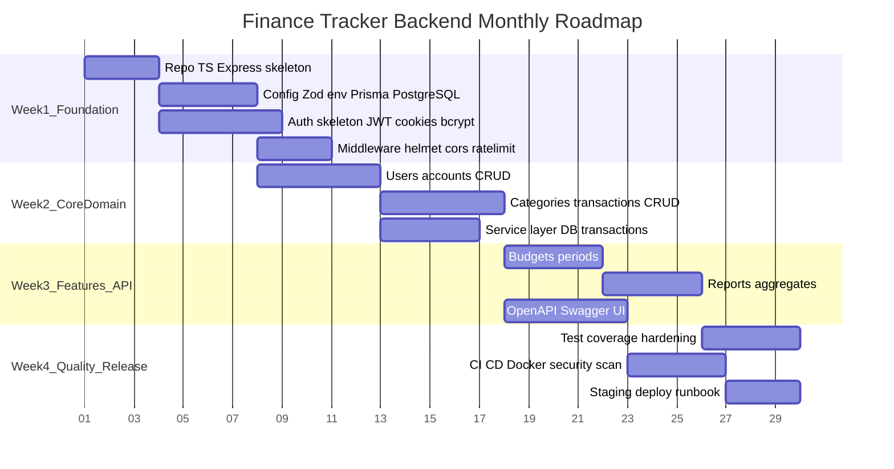

# Роадмеп (4 тижні)

**Пов’язано:** [06-team-workflow.md](06-team-workflow.md) · [12-testing.md](12-testing.md) · [13-ci-cd.md](13-ci-cd.md)

Горизонт планування: **один місяць**, команда **3 розробники**. Фокус — робочий MVP API з тестами, CI та документацією.

## Високорівневий Gantt

> Дати в діаграмі — **приклад**; підставте реальні стартові дні спринту.

## Тиждень 1 — Фундамент

| Ціль | Результат |
|------|-----------|
| Репозиторій і збірка | `npm run dev`, `npm run build`, ESLint + Prettier |
| Конфіг | Валідація `.env` через Zod у `src/config/` |
| БД | `schema.prisma` (мінімум User), перша міграція, seed-скелет |
| Auth (скелет) | Реєстрація/логін, bcrypt, видача пар токенів, cookies |
| Безпека базова | Helmet, CORS allowlist, rate limit на `/auth` |

**Ризики:** конфлікти в `schema.prisma` — узгодити «owner» файлу або працювати послідовно в перший тиждень.

## Тиждень 2 — Ядро домену

| Ціль | Результат |
|------|-----------|
| Рахунки | CRUD, правила валюти/назви |
| Категорії | CRUD, тип дохід/витрата |
| Транзакції | CRUD, фільтри, пагінація, узгоджені зміни балансу в транзакції БД |

**Критерій готовності:** основні user journeys з [01-overview.md](01-overview.md) виконуються через API (ручні перевірки + перші integration тести).

## Тиждень 3 — Бюджети, звіти, контракт

| Ціль | Результат |
|------|-----------|
| Бюджети | Ліміт на категорію за календарний місяць (або обраний період) |
| Звіти | Суми за період, порівняння з бюджетом |
| OpenAPI | Реєстр маршрутів, Swagger UI, схеми з Zod |

## Тиждень 4 — Якість і реліз

| Ціль | Результат |
|------|-----------|
| Тести | Підняти coverage до **≥ 80%** на критичних модулях |
| CI/CD | Пайплайн з [13-ci-cd.md](13-ci-cd.md), артефакт Docker image |
| Документація | README, runbook staging, 1–2 нові ADR за потреби |
| Безпека | Перегляд заголовків, CORS, лімітів, секретів |

## Ознаки успіху кінця місяця

- Деплой на staging однією командою (`docker compose` або CI).
- Новий розробник проходить [14-setup.md](14-setup.md) за < 1 год (за наявності Docker).

## Навігація

- Розподіл задач: [06-team-workflow.md](06-team-workflow.md)
- ER-модель: [07-database.md](07-database.md)
