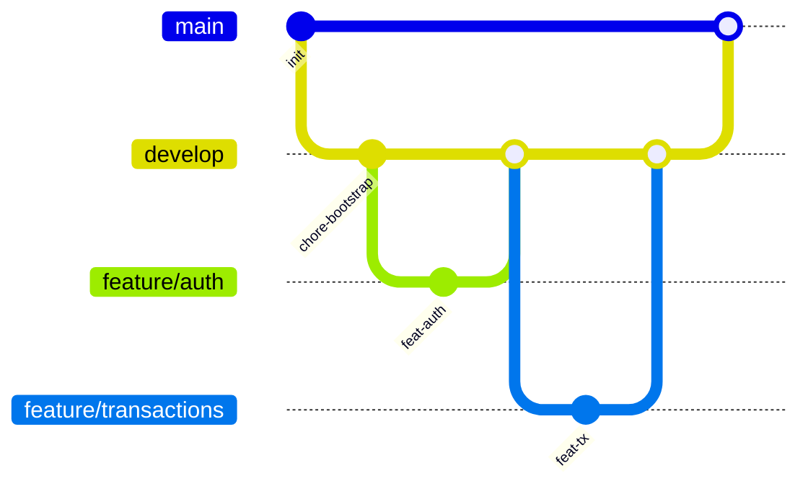

# Командний процес

**Пов’язано:** [05-roadmap.md](05-roadmap.md) · [15-conventions.md](15-conventions.md) · [13-ci-cd.md](13-ci-cd.md)

Команда: **3 розробники**, горизонт **4 тижні**. Мета — паралельна робота з мінімальним блокуванням і передбачуваними інтеграціями.

## Розподіл відповідальності (рекомендований)

| Роль | Фокус | Типові артефакти |
|------|--------|------------------|
| **Dev A — Auth / Security / Infra** | Реєстрація, логін, JWT + cookies, bcrypt, Helmet, CORS, rate limit, Docker, CI скелет | `middleware/auth`, `services/auth`, `repositories/user*`, `.github/workflows`, `docker/` |
| **Dev B — Core domain** | Рахунки, категорії, транзакції, інваріанти балансу, Prisma-моделі домену | `services/*`, `repositories/*`, `controllers/*`, `routes/v1/*`, зміни в `schema.prisma` (узгоджено) |
| **Dev C — Budgets / Reports / QA-Docs** | Бюджети, агрегати звітів, OpenAPI polish, тест-план, покриття | `services/report*`, `repositories/report*`, `validators`, `tests/`, `docs/` |

> Ролі не жорсткі: при блокерах — короткий **pairing** або тимчасовий обмін задачею.

## Git-стратегія

- **`main`** — стабільна гілка, лише через PR, захист CI.
- **`develop`** (або `dev`) — інтеграційна гілка спринту.
- **`feature/<ticket>-short-name`** — атомарні фічі від `develop`.

## Pull Request — правила

1. Один PR — одна логічна зміна (feature/fix/chore).
2. Обов’язково: **лінтер / типи / тести** локально або через CI.
3. Для змін у `prisma/schema.prisma`: окремий коміт міграції, зрозуміла назва міграції, без ручних правок SQL без потреби.
4. Мінімум **1 approve** від іншого розробника перед merge у `develop`.

## Code review — чекліст рев’юера

- [ ] Бізнес-інваріанти (суми, доступ до ресурсів по `userId`) у **services**; у **repositories** — лише доступ до даних без бізнес-правил.
- [ ] Немає секретів у коді / логах.
- [ ] Помилки проходять через `AppError` / error middleware (див. [10-error-handling.md](10-error-handling.md)).
- [ ] Нові ендпоінти мають Zod + запис у OpenAPI (якщо вже підключено).
- [ ] Тести оновлені або додані для критичної логіки.

## Управління конфліктами у `schema.prisma`

- Призначити **gatekeeper** схеми на тиждень (ротація).
- Не тримати довгоживучі гілки з різними міграціями — щоденний merge у `develop`.
- При колізії міграцій: об’єднати зміни, згенерувати одну нову міграцію після rebase.

## Комунікація

- **Daily async** (15 хв): блокери + план на день (чат).
- **Mid-sprint sync** (30 хв): демо інтеграції на `develop`.
- **Release checklist** перед тегом: [13-ci-cd.md](13-ci-cd.md), smoke-тести staging.

## Навігація

- БД та узгодження моделей: [07-database.md](07-database.md)
- Конвенції комітів: [15-conventions.md](15-conventions.md)
