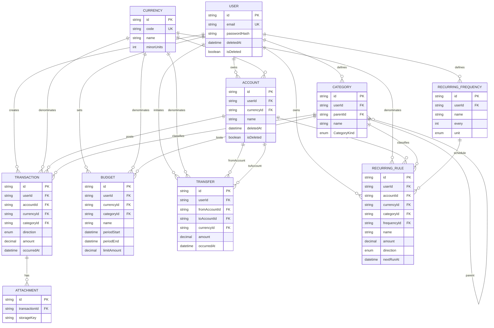

# База даних

**Пов’язано:** [04-tech-stack.md](04-tech-stack.md) · [08-api-design.md](08-api-design.md) · [adr/0004-recurring-frequency-and-s3-attachments.md](adr/0004-recurring-frequency-and-s3-attachments.md)

СУБД: **PostgreSQL**. ORM і міграції: **Prisma**.

У коді додатку всі звернення до Prisma з доменної логіки йдуть через **`src/repositories/`** (див. [03-project-structure.md](03-project-structure.md)); папка **`prisma/`** на корені репозиторію лише для схеми, міграцій і seed — не для TypeScript-репозиторіїв.

## Prisma Client (згенерований код)

У [`prisma/schema.prisma`](../prisma/schema.prisma) задано кастомний output:

```prisma
generator client {
  provider = "prisma-client"
  output   = "../src/generated/prisma"
}
```

Клієнт і типи генеруються в **`src/generated/prisma/`**. Ці файли **не редагують вручну**; після змін схеми виконуйте `npx prisma generate` (або `npm run build` / `npm install`, де це передбачено скриптами).

## Enums у схемі

| Enum                    | Призначення                                                                                                                                 |
| ----------------------- | ------------------------------------------------------------------------------------------------------------------------------------------- |
| `TransactionDirection`  | Напрямок операції доходу/витрати (`INCOME` / `EXPENSE`) для транзакцій і регулярних правил.                                                 |
| `CategoryKind`          | Тип категорії доходу/витрати (`INCOME` / `EXPENSE`).                                                                                        |
| `RecurringIntervalUnit` | Одиниця інтервалу для користувацької періодичності (`DAY`, `WEEK`, `MONTH`, `YEAR`) разом із числовим полем `every` у `RecurringFrequency`. |

Таблиця **`RecurringFrequency`** замінює фіксований enum частоти: користувач може задавати власні іменовані шаблони (наприклад «кожні 2 тижні»).

## Концептуальна ER-модель

Відповідає поточній [`schema.prisma`](../prisma/schema.prisma). Ідентифікатори — `cuid`; у діаграмі для читабельності зазначено лише ключові поля та зв’язки.



> Деталі колонок (`@map`, `Decimal(19,4)`, унікальні обмеження) — у `schema.prisma`.

## Ключові інваріанти

1. **Ізоляція даних:** усі запити до сутностей фільтруються за `userId` з автентифікованого контексту (крім адмінських сценаріїв, яких у MVP немає).
2. **Баланс рахунку:** у схемі **немає** збереженого поля `balance` на `Account`. Суми виводяться агрегацією транзакцій (і за потреби переказів) у сервісному шарі; узгоджені зміни кількох рядків — у **`prisma.$transaction`**.
3. **Унікальність:** `User.email`, `Currency.code` унікальні; `RecurringFrequency` має складний унікальний ключ `(userId, name, isDeleted)` для іменованих шаблонів періодичності.
4. **Вкладення (S3):** у БД зберігається `Attachment.storageKey`; публічні або тимчасові URL не дублюються в таблиці (генеруються при видачі). Див. [ADR 0004](adr/0004-recurring-frequency-and-s3-attachments.md).

## Індекси (фактичні в схемі)

| Модель               | Індекс                             | Навіщо                                 |
| -------------------- | ---------------------------------- | -------------------------------------- |
| `Account`            | `(userId, isDeleted)`              | Списки рахунків користувача.           |
| `Category`           | `(userId, isDeleted)`              | Списки категорій.                      |
| `Transaction`        | `(userId, isDeleted, occurredAt)`  | Звіти та списки за період.             |
| `Transaction`        | `(accountId)`                      | Операції по рахунку.                   |
| `Transaction`        | `(currencyId)`                     | Фільтри/звіти по валюті.               |
| `Transfer`           | `(userId, isDeleted, occurredAt)`  | Історія переказів.                     |
| `Transfer`           | `(fromAccountId)`, `(toAccountId)` | Зв’язки з рахунками.                   |
| `Budget`             | `(userId, isDeleted)`              | Бюджети користувача.                   |
| `RecurringRule`      | `(userId, isDeleted)`              | Правила користувача.                   |
| `RecurringRule`      | `(currencyId)`, `(frequencyId)`    | Запити за валютою та шаблоном частоти. |
| `RecurringFrequency` | `(userId, isDeleted)`              | Шаблони періодичності.                 |
| `Attachment`         | `(transactionId)`                  | Вкладення до транзакції.               |

## Міграції

| Команда                                      | Коли                                                  |
| -------------------------------------------- | ----------------------------------------------------- |
| `npx prisma migrate dev --name <meaningful>` | Локальна розробка після зміни `schema.prisma`         |
| `npx prisma migrate deploy`                  | CI/prod — застосувати наявні міграції без інтерактиву |

**Правила:**

- Не редагувати вручну застосовані міграції в спільному репозиторії.
- Деструктивні зміни — через окремий PR і ADR за потреби.

## Seed

- **Мета:** передбачувані демо-дані для dev/staging.
- **Реалізація:** `prisma/seed.ts`, скрипт у `package.json`: `npm run prisma:seed`.
- **Не містити** реальних паролів; використовувати відомий тестовий пароль лише для локалі.

## Тестова БД

- Окремий `DATABASE_URL` для тестів (інший порт або інша база в Compose).
- У CI використовується сервіс PostgreSQL і `npx prisma migrate deploy` перед тестами (див. [13-ci-cd.md](13-ci-cd.md), [12-testing.md](12-testing.md)).

## Навігація

- API поверх моделі: [08-api-design.md](08-api-design.md)
- Безпека доступу до даних: [09-security.md](09-security.md)
