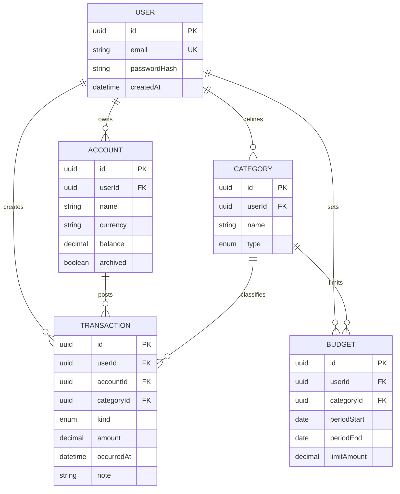

# База даних

**Пов’язано:** [04-tech-stack.md](04-tech-stack.md) · [08-api-design.md](08-api-design.md)

СУБД: **PostgreSQL**. ORM і міграції: **Prisma**.

У коді додатку всі звернення до Prisma з доменної логіки йдуть через **`src/repositories/`** (див. [03-project-structure.md](03-project-structure.md)); папка **`prisma/`** на корені репозиторію лише для схеми, міграцій і seed — не для TypeScript-репозиторіїв.

## Концептуальна ER-модель (MVP)

> Поля й типи (`enum`) уточнюються в `schema.prisma`; діаграма відображає зв’язки.

## Ключові інваріанти

1. **Ізоляція даних:** усі запити до сутностей фільтруються за `userId` з автентифікованого контексту (крім адмінських сценаріїв, яких у MVP немає).
2. **Транзакції БД:** зміна `TRANSACTION` і перерахунок/оновлення `ACCOUNT.balance` виконуються в одній **`prisma.$transaction`**.
3. **Унікальність:** `USER.email` унікальний; за потреби — часткові унікальні індекси (наприклад, одна категорія «за замовчуванням» на тип).

## Індекси (рекомендації)

- `TRANSACTION(userId, occurredAt DESC)` — списки та звіти за період.
- `TRANSACTION(accountId)` — операції по рахунку.
- `BUDGET(userId, categoryId, periodStart)` — швидкий пошук бюджету на місяць.

## Міграції

| Команда | Коли |
|---------|------|
| `npx prisma migrate dev --name <meaningful>` | Локальна розробка після зміни `schema.prisma` |
| `npx prisma migrate deploy` | CI/prod — застосувати наявні міграції без інтерактиву |

**Правила:**

- Не редагувати вручну застосовані міграції в спільному репозиторії.
- Деструктивні зміни — через окремий PR і нотатку в ADR за потреби.

## Seed

- **Мета:** передбачувані демо-дані для dev/staging.
- **Реалізація:** `prisma/seed.ts`, скрипт у `package.json`: `"prisma": { "seed": "tsx prisma/seed.ts" }` (приклад).
- **Не містити** реальних паролів; використовувати відомий тестовий пароль лише для локалі.

## Тестова БД

- Окремий `DATABASE_URL` для тестів (інший порт або інша база в Compose).
- Перед integration suite: `migrate deploy` або `db push` за командою проєкту (узгодити один підхід у [12-testing.md](12-testing.md)).

## Навігація

- API поверх моделі: [08-api-design.md](08-api-design.md)
- Безпека доступу до даних: [09-security.md](09-security.md)
